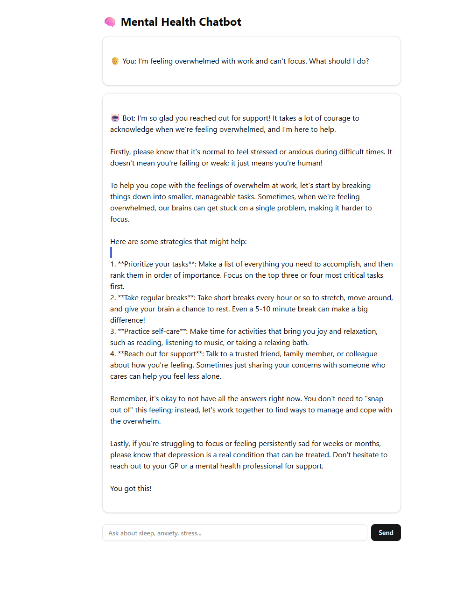

# 🧠 Mental Health Support Chatbot (RAG + Ollama)

A private and personalized mental health chatbot built using:

- 🔍 **Retrieval-Augmented Generation** (RAG)
- 🧠 **Ollama (LLaMA 3)** for local LLM inference
- 📚 FAISS for document search
- 📄 PDF knowledge base
- 💬 Real-time **streaming** chat UI with Next.js + shadcn

---

## 📖 Table of Contents

1. [Demo](#-demo)
2. [Architecture](#-architecture)
3. [Features](#-features)
4. [Getting Started](#-getting-started)
   - [Backend (Python)](#backend-python)
   - [Frontend (Next.js)](#frontend-nextjs)

---

## 📸 Demo

> Add a GIF or screenshot of your app here.



---

## 🧱 Architecture

```
User → Next.js Chat UI → Flask API
                            ↑ ↓
                            Stream Ollama + FAISS
```

This architecture ensures:
- A seamless user experience with a modern chat interface.
- Local inference and document retrieval for privacy and speed.

---

## 🔧 Features

- Upload and index PDF documents locally.
- Ask mental health questions (e.g., anxiety, insomnia).
- Responses are grounded in your uploaded documents.
- LLM runs locally via Ollama (no external API required).
- Fully private with real-time streaming output.

## 📚 Knowledge Base Setup

The chatbot uses a vector database to store and retrieve relevant information from your documents. Here's how to set it up:

1. **Prepare your documents**: Place your mental health resources (`.txt` files) in the `backend/data/resources/` directory
2. **Build the index**: Run `python index_builder.py` to create embeddings and build the FAISS index
3. **Resources examples**: You can include various types of mental health content such as:
   - Mental health guides and articles
   - Coping strategies and techniques
   - Treatment information
   - Self-help resources
   - Research papers (converted to text)

The index builder will automatically chunk your documents and create searchable embeddings that the chatbot uses to provide contextual responses.

---

## 🚀 Getting Started

### Backend (Python)

1. Navigate to the backend directory:
   ```bash
   cd backend
   ```
2. Install the required dependencies:
   ```bash
   pip install -r requirements.txt
   ```

3. **Build the Knowledge Base (First Time Setup)**:
   
   Before running the chatbot, you need to build the vector index from your documents:
   
   a. Add your mental health resources (PDF/text files) to the `data/resources/` directory
   
   b. Run the index builder to create embeddings:
   ```bash
   python index_builder.py
   ```
   
   This will:
   - Load all `.txt` files from `data/resources/`
   - Split them into chunks (500 characters each)
   - Generate embeddings using sentence-transformers
   - Save the FAISS index to `data/index.faiss`
   - Save metadata to `data/metadata.json`

4. Start the backend server:
   ```bash
   python app.py
   ```

### Frontend (Next.js)

1. Navigate to the frontend directory:
   ```bash
   cd frontend
   ```
2. Install the required dependencies:
   ```bash
   npm install
   ```
3. Start the development server:
   ```bash
   npm run dev
   ```

> **Note:** Ollama must be running locally. Use the following command to start it:
> ```bash
> ollama run llama3
> ```

---